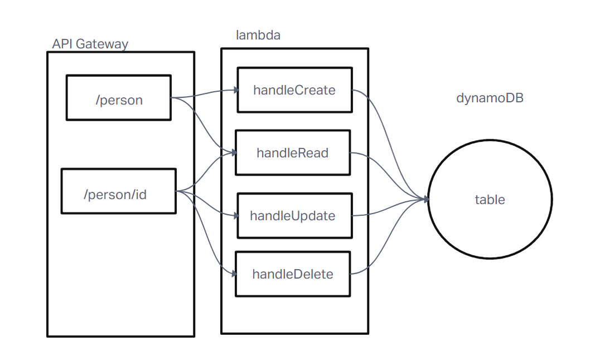

### LAB 18

## Project: AWS - LAB 18

## Authors: Adrienne Frey

## Problem Domain

Create a single resource REST API using a domain model of your choosing, constructed using AWS Cloud Services.

Database: DynamoDB
1 Table required.
Routing: API Gateway
POST
/people - Given a JSON body, inserts a record into the database.
returns an object representing one record, by its id (##).
GET
/people - returns an array of objects representing the records in the database.
/people/## - returns an object representing one record, by its id (##).
PUT
/people/## - Given a JSON body and an ID (##), updates a record in the database.
returns an object representing one record, by its id (##).
DELETE
/people/## - Given an id (##) removes the matching record from the database.
returns an empty object.
CRUD Operation Handlers: Lambda Functions

## Links and Resources 

## Setup

## `.env` requirements (where applicable)

### How to Initialize/run your application(where applicable)
node index.js

### UML

### Documentation

Create one table for one data model at Dynamo DB.
Create a Dynamoose schema to define the structure of your table.
Write lambda functions that will separately perform the proper CRUD operation on the database.
Create your routes using API Gateway.
Routes should integrate with the appropriate Lambda function to perform the operation.
